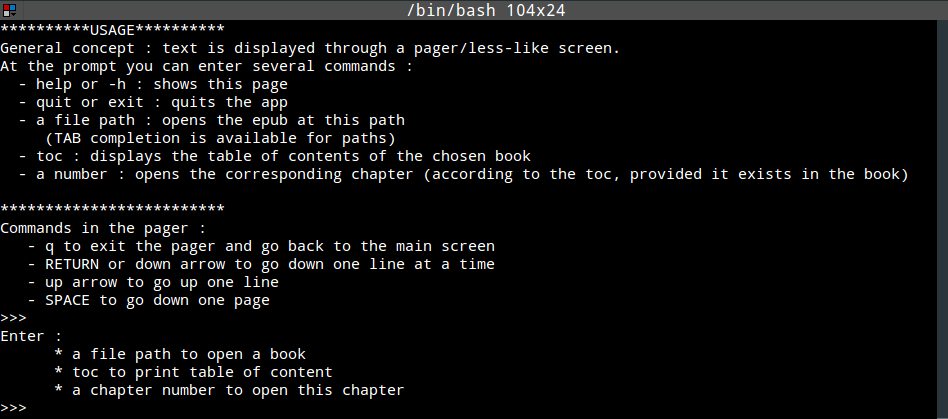
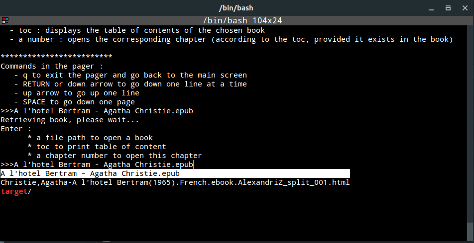
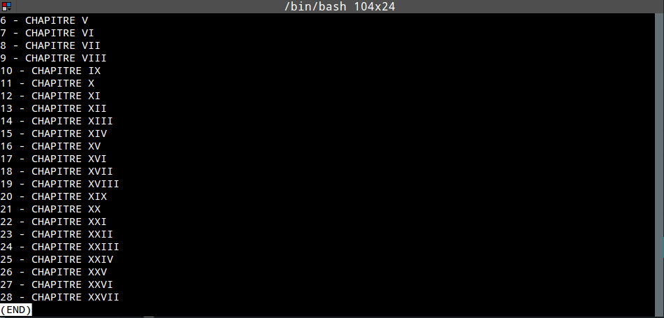

# Termepub : an epub reader for terminal

## What ?

This is toy a Java app destined to open .epub files directly in your terminal.

This can be useful to open some documentation when connected to a headless server or when SSHing.

Obviously pictures are not displayed.

When you launch it, you get an interactive prompt.

At the prompt you can :

* select a file name to open it

* get interactive help

* exit the app

* display the table of content of the currently active (opened) book

You get TAB autocompletion for all of these commands (even file names).

Content is displayed in a Less style pager.

Typical flow is :

* launch the app

* open a file

* see its table of content

* display the chapter you want to read

## Screenshots

Overview

TAB completion (pressed `a` then `TAB` multiple times to cycle through file names)

Table of contents, now just hit `q` to exit and enter the number you want.

## TODO

* better packaging (launching a jar isn't optimal). Currently it is a so called fat jar or uber jar (all dependencies are provided in it, so you just need this only jar). The current jar weights 1.9Mo.

* use terminal colors to manage formatted content in books (like bold etc...)
